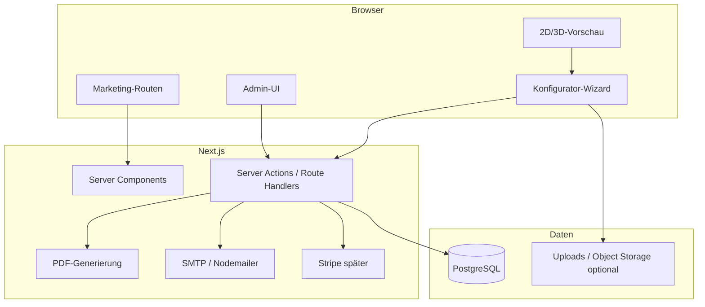

# Grabstein Konfigurator — Architektur- & Implementierungsplan

Dieses Dokument beschreibt die **Zielarchitektur**, den **Tech-Stack**, **Modulgrenzen** und eine **phasenweise Roadmap**, damit die Implementierung startklar ist. Anpassungen sind erwünscht, sobald erste Kundenfälle klar sind.

---

## 1. Ziele & Leitplanken

| Ziel | Leitplanke |
|------|------------|
| Wizard von Grabtyp bis Zusammenfassung | Schritt-für-Schritt, Zustand serverseitig persistierbar (Wiederaufnahme / Admin) |
| Preisberechnung | Regelbasiert, zentral gepflegt (kein Hardcode in UI-Komponenten) |
| Dokumente | DE: Auftrag/Angebot; EN: Lieferanten-Blatt; optional Render-Bild |
| 3D-Vorschau | MVP: 2D/„einfaches 3D“; später PBR + bessere Modelle |
| Kein Webflow etc. | Alles in **einer** eigenen App (Marketing + Konfigurator + Admin) |
| E-Mail | **Eigenes SMTP** (Nodemailer), keine Pflicht zu SendGrid/Mailgun |
| Kosten Assets | Free / CC0 / CC-BY (ohne **NC**, falls kommerziell genutzt) |

---

## 2. Architekturüberblick

**Empfehlung: eine Next.js-Anwendung** (App Router, TypeScript). Begründung: eine Codebasis für öffentliche Seiten, Konfigurator, API-Routen, PDF- und Mail-Jobs; später einfacher zu deployen als verteilte Microservices.



- **„Dünne“ API-Schicht:** Server Actions für Formulare/Wizard-Schritte; Route Handler (`app/api/...`) wo Streaming, Webhooks (Stripe) oder Roh-Binary (PDF-Download) klarer sind.
- **Admin** zunächst geschützt (Session); Konfigurator öffentlich oder mit optionalem „Entwurf speichern“ per Link.

---

## 3. Tech-Stack (Vorschlag)

| Bereich | Technologie | Anmerkung |
|---------|-------------|-----------|
| Framework | **Next.js** (aktueller LTS), **TypeScript** | App Router |
| UI | **Tailwind CSS** + Headless primitives (Radix) optional | Einheitliches Design |
| Wizard-State | **Zustand** oder **XState** (wenn komplexe Übergänge) | URL-Schritt `?step=` optional für Teilen |
| Validierung | **Zod** | Geteilte Schemas Client/Server |
| ORM | **Prisma** | Migrationen, Typsicherheit |
| DB | **PostgreSQL** (z. B. Neon, oder Docker lokal) | SQLite nur für sehr frühe Prototypen, wenn ihr DB-Features vermeiden wollt |
| 3D | **Three.js** + **@react-three/fiber** + **@react-three/drei** | `useGLTF`, `Environment`, PBR |
| Text auf Stein | **troika-three-text** oder Canvas-Textur | MVP oft schneller mit Textur |
| PDF | **@react-pdf/renderer** *oder* **pdf-lib** auf dem Server | Templates versionieren; Rechtstexte extern pflegen |
| Mail | **Nodemailer** + Env: `SMTP_*` | SPF/DKIM/DMARC auf Domain |
| Auth (Admin) | **Auth.js** (NextAuth) oder **Better Auth** | Nur Rollen `admin` zunächst |
| Zahlungen | **Stripe** (spätere Phase) | Webhook-Route, Idempotenz |
| Jobs (optional) | Queue später (BullMQ, Inngest) | Erst synchron in Request, bei Volumen auslagern |

---

## 4. Repository-Struktur (Vorschlag)

```
Grabstein Konfigurator/
├── app/
│   ├── (marketing)/          # Landing, Impressum, AGB-Platzhalter
│   ├── (configurator)/       # Wizard-Routen, Layout mit Fortschritt
│   ├── (admin)/              # Geschützt: Preise, Bestellungen, Assets
│   └── api/                  # Webhooks, PDF-Download, Health
├── components/
│   ├── ui/                   # Buttons, Dialoge, …
│   ├── wizard/               # Schritt-Komponenten
│   └── preview/              # Canvas / R3F-Canvas
├── lib/
│   ├── pricing/              # Reine Funktionen: Eingabe Konfig → Betrag
│   ├── pdf/                  # Template-Zusammenbau
│   ├── mail/                 # SMTP-Versand, Templates
│   └── db/                   # Prisma client singleton
├── config/
│   └── catalog/              # JSON/YAML: Materialien, Add-ons (bis DB reift)
├── prisma/
│   └── schema.prisma
├── public/
│   └── models/               # glTF/glB (lizenziert, siehe ATTRIBUTIONS.md)
├── docs/
│   └── ARCHITECTURE.md       # dieses Dokument
└── ATTRIBUTIONS.md           # 3D-Assets, Fonts, CC-BY
```

---

## 5. Domänenmodule

### 5.1 Konfiguration (Wizard)

- **Domain-Modell:** typsicheres Objekt `MonumentConfiguration` (Grabtyp, Form, Material, Maße, Schrift, Gravur, Ornamente, Bronze, Einfassung, …).
- **Schritte:** UI nur; Validierung pro Schritt mit Zod; Gesamtvalidierung vor „Absenden“.
- **Persistenz:** Entwurf in DB (`Draft` / `Order` mit Status `draft`), optional Magic-Link zum Fortsetzen.

### 5.2 Preisengine (`lib/pricing`)

- **Eingabe:** `MonumentConfiguration` + ggf. Ländercode (Steuersatz).
- **Ausgabe:** Positionsliste (Name, Menge, Einzelpreis, Summe), Zwischensummen, Steuer, Gesamt.
- **Regeln:** Tabellen aus DB oder aus `config/catalog` (Import in DB beim Deploy). Keine Preislogik in React-Komponenten.
- **Sonderfälle:** Zeichenzahl Schrift, Aufschlag zweite Sprache, Mindestmaße — als klar benannte Regelfunktionen testbar (`*.test.ts`).

### 5.3 Dokumente

- **Kunde DE:** PDF aus Template (HTML→PDF nur wenn ihr ein Tool festlegt; sonst programmatisch mit react-pdf/pdf-lib).
- **Lieferant EN:** separates Template, gleiche Konfigurationsquelle.
- **Render-Bild:** später Screenshot aus WebGL (`canvas.toDataURL`) oder Server-Render-Pipeline (nur wenn nötig).

### 5.4 E-Mail

- Transaktionen: „Bestätigung Eingang“, „PDF angehängt“, intern „Neue Konfiguration“.
- **Konfiguration:** nur Env, kein Drittanbieter-Zwang.
- Fehler: loggen + Admin-Benachrichtigung bei SMTP-Fehler.

### 5.5 3D-Vorschau (`components/preview`)

- **Phase A:** Statisches GLTF + Material-Swap (Roughness/Color-Maps) + Text als Textur/troika.
- **Phase B:** Mehrere Modelle pro Formfamilie; HDRI aus drei.
- **Phase C:** Aufwändigere Effekte (Displacement, Postprocessing) — nach Bedarf.

### 5.6 Admin

- Listen: Bestellungen / Entwürfe, Statuspipeline.
- CRUD: Katalogpreise, aktive Materialien, Textbausteine (Widerruf, Fußzeile).
- Kein CMS-Produkt nötig: Formulare + DB reichen.

---

## 6. Datenmodell (MVP-Skizze)

Entitäten (angepasst werden, sobald rechtlicher Ablauf fix ist):

- **User** (nur Admins) — E-Mail, Passwort-Hash, Rolle.
- **Order** — Status (`draft`, `submitted`, `deposit_pending`, …), `configuration` (JSON), berechnete Summen, Kundendaten, Timestamps.
- **CatalogItem** (optional normalisiert) — SKU, Typ, Basispreis, Metadaten; oder anfangs nur JSON-Import in `Order` snapshots.
- **Asset** — Verweis auf Datei (Foto-Upload Laser), Speicherpfad/URL, Löschfrist (DSGVO).

`configuration` als **JSON-Spalte** + Zod-Schema Version `schemaVersion: 1` erleichtert Migrationen.

---

## 7. Sicherheit & Compliance (Kurz)

- **DSGVO:** Auftragsverarbeitung, Fotos, Speicherdauer, Löschkonzept; Cookie-Banner nur was gesetzt wird.
- **Uploads:** Typ/Größe begrenzen, Virenscan optional später.
- **Admin:** Rate-Limit Login, starke Passwörter, 2FA später.
- **Secrets:** nur `.env` / Secret-Store, nie Git.

---

## 8. Deployment (später konkretisieren)

- Beispiel: **VPS + Docker** oder **Vercel** + verwaltete Postgres — abhängig von Hosting-Wunsch und SMTP (ausgehende Ports).
- **Umgebungen:** `development`, `staging`, `production` mit getrennten DBs und SMTP-Test-Inbox.

---

## 9. Implementierungs-Roadmap

### Phase 0 — Fundament (ca. 1 Woche)

- [ ] Next.js + TS + Tailwind + ESLint/Prettier
- [ ] Prisma + PostgreSQL (Docker Compose optional)
- [ ] Basis-Layouts: Marketing, Wizard-Shell, Admin-Shell
- [ ] `ATTRIBUTIONS.md` anlegen

### Phase 1 — Wizard + Preis ohne 3D (ca. 1–2 Wochen)

- [ ] Zustand/Zod: alle Wizard-Schritte (UI + Validierung)
- [ ] `lib/pricing` + Tests mit Beispiel-Katalog (`config/catalog`)
- [ ] Entwurf in DB speichern / laden
- [ ] Zusammenfassungsseite mit Positionsliste

### Phase 2 — PDF + SMTP (ca. 1 Woche)

- [ ] PDF DE + PDF EN aus `Order`
- [ ] Nodemailer: Versand an Kunde + optional intern + Anhänge
- [ ] Download-Link für PDF als Fallback

### Phase 3 — 3D MVP (ca. 1–2 Wochen)

- [ ] Ein CC0/CC-BY-Modell in `public/models`
- [ ] R3F-Scene: OrbitControls, Environment, Materialwechsel
- [ ] Namen/Datum auf Oberfläche (troika oder Textur)
- [ ] Screenshot-Button → PNG für Anhang/Archiv

### Phase 4 — Admin + Katalog (ca. 1 Woche)

- [ ] Auth für Admin
- [ ] CRUD Katalog / Import JSON
- [ ] Bestellübersicht, Status ändern

### Phase 5 — Zahlungen (nach rechtlicher Freigabe)

- [ ] Stripe: Anzahlung / Webhooks
- [ ] Status `paid_deposit` automatisch

---

## 10. Nächster konkreter Schritt nach diesem Plan

1. Repo mit **Phase 0** scaffolden (`create-next-app`, Prisma, Ordner wie oben).
2. **Ein** Referenz-Preis-Szenario (z. B. Urnengrab Stele schwarz) als **Golden-Test** für `lib/pricing`.
3. Erstes **GLTF** einbinden und leere Wizard-Seite mit **Schritt 1** verbinden (noch ohne Speicherung).

Wenn du möchtest, kann als nächster Schritt direkt **Phase 0 im Repository ausgeführt** werden (Scaffold + Prisma-Schema-V0).
